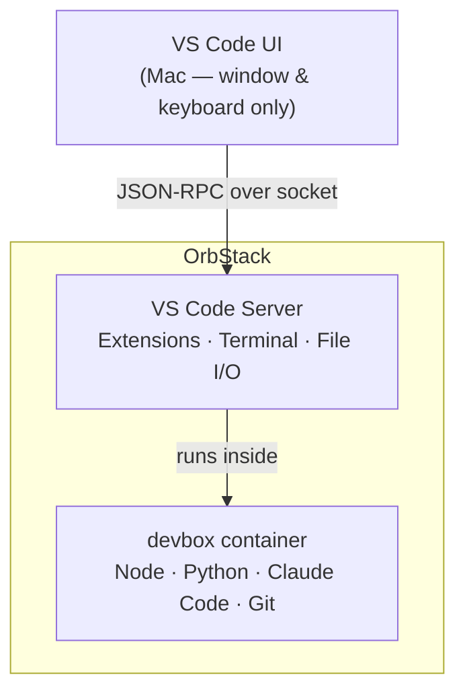
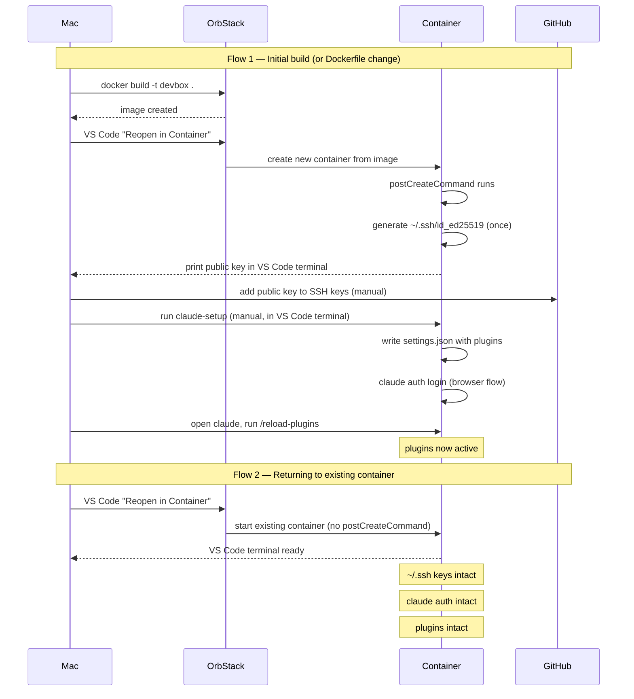

# devenv

A repeatable, security-isolated development environment for macOS. All code, tools, and AI agents run inside an OrbStack container — your Mac stays clean.

---

## Why

- **Supply chain safety** — malicious npm/pip packages can't reach your host
- **Secrets isolation** — host credentials, SSH keys, and browser data are unreachable from inside the container
- **Agentic safety** — Claude Code and Cursor agents operate inside a sandbox, not on your Mac
- **Repeatability** — one `docker build` recreates the full environment from scratch on any machine

---

## What's inside the container

- Ubuntu 24.04, non-root `dev` user
- Node (via nvm, LTS), Python 3, pipx, Bun
- Claude Code CLI
- Git with SSH key generated on first container creation

---

## Architecture



The VS Code window on your Mac is a thin UI shell. Every meaningful action — terminals, linters, extensions, file I/O — runs inside the container.

---

## Container lifecycle



---

## Prerequisites

- [OrbStack](https://orbstack.dev) installed on macOS
- VS Code or Cursor with the **Dev Containers** extension
- OrbStack set as active Docker context — verify with `docker context ls` (look for `orbstack *`)

---

## Initial setup

### 1. Build the devbox image

Run once, and again after any `Dockerfile` change:

```bash
cd ~/Projects/devenv
docker build -t devbox .
```

### 2. Create a new project

```bash
~/Projects/devenv/new-project.sh my-project
```

This creates `~/Projects/my-project/`, initialises a git repo, and copies the Dev Containers config.

### 3. Open in VS Code / Cursor

1. Open the project folder in VS Code
2. Click **Reopen in Container** when prompted — or use the command palette: `Dev Containers: Reopen in Container`
3. Wait for the container to start (fast after the first build)
4. The blue banner `Dev Container: devbox` confirms you are inside the container

### 4. Register the SSH key with GitHub

The container generates an SSH key on first creation. The public key prints in the VS Code terminal automatically. If it doesn't:

```bash
cat ~/.ssh/id_ed25519.pub
```

Copy it to [GitHub → Settings → SSH keys → New SSH key](https://github.com/settings/ssh/new), then verify:

```bash
ssh -T git@github.com
```

### 5. Set up Claude

Run from the **VS Code terminal** (not your Mac terminal — running from Mac targets host Claude instead):

```bash
claude-setup
```

This writes `~/.claude/settings.json` with baseline plugins and triggers the browser auth flow if not already authenticated.

Then activate the plugins inside Claude:

```bash
claude
```

Once inside:
```
/reload-plugins
```

Plugins are now active for the session.

---

## Returning to a project

Open the project folder in VS Code and click **Reopen in Container**. Your SSH keys, Claude auth, and plugins are all intact — no setup needed.

---

## Rebuilding the container

Only needed when you change the `Dockerfile`. After rebuilding:

1. Re-register the new SSH key with GitHub (a new key is generated)
2. Re-run `claude-setup` inside the container

Your project files are never affected — they live on your Mac and are bind-mounted into the container.

---

## Key boundaries

| Lives on Mac | Lives in container |
|---|---|
| Project files (`~/Projects/`) | Runtimes (Node, Python) |
| Host SSH keys | Container SSH key |
| Mac credentials & keychain | Claude auth & plugins |
| `devenv` repo | Installed packages |
