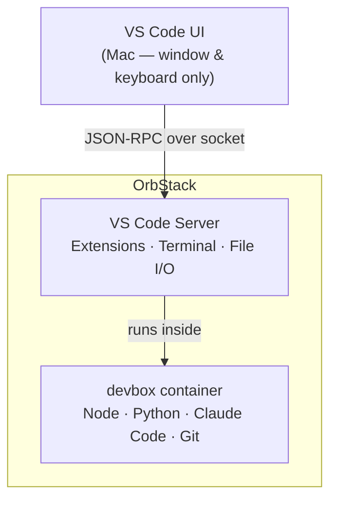

# devenv

A Docker-based development sandbox that runs all code, tools, and AI agents inside an isolated container, keeping your Mac host clean and secure.

Repeatable, security-isolated dev environment on macOS using OrbStack + Docker.

Built to prevent supply-chain packages, secrets leakage, and agentic tools from touching your host filesystem or credentials.

---

## How it works



The VS Code window on your Mac is a thin UI shell. Every meaningful action — terminals, linters, extensions, file I/O — runs inside the container.

---

## Prerequisites

- [OrbStack](https://orbstack.dev) installed on macOS
- VS Code or Cursor with the **Dev Containers** extension

---

## Build the devbox image

Run once (and again after any `Dockerfile` change):

```bash
cd ~/Projects/devenv
docker build -t devbox .
```

---

Create a new project

```bash
~/Projects/devenv/new-project.sh my-project
```

This creates ~/Projects/my-project/, initialises a git repo, and copies the Dev Containers config.

---

Open in VS Code / Cursor

1. Open the project folder in VS Code
2. When prompted, click Reopen in Container — or use the command palette: Dev Containers: Reopen in Container
3. Wait for the container to start (fast after first build)
4. The blue banner Dev Container: devbox confirms you are inside the container

All terminals, extensions, and tools now run inside the isolated environment.

---

One-time: SSH key setup per container

Each new container generates its own SSH key. After first open:

1. The public key prints in the VS Code terminal during container creation
2. Copy it to GitHub → Settings → SSH keys → New SSH key
3. Verify with ssh -T git@github.com inside the container

If the key doesn't print (container already existed), run inside the terminal:
cat ~/.ssh/id_ed25519.pub

---

## One-time: Claude setup per container

After the container is created, run the setup script to authenticate and install baseline skills and plugins:

```bash
~/projects/devenv/claude-setup.sh
```

This will:
1. Check if you're authenticated — if not, trigger the browser auth flow
2. Install baseline plugins: `skill-creator`, `superpowers`, `claude-mem`, `frontend-design`

Only needed again if you rebuild the container.
